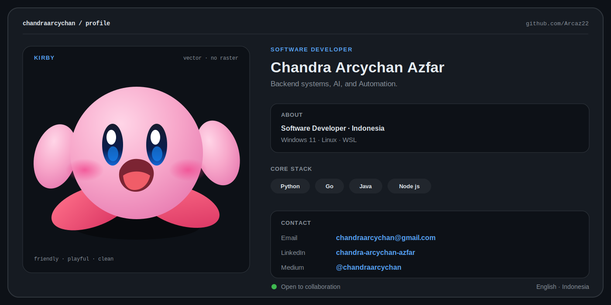

<picture>
<source media="(prefers-color-scheme: dark)" srcset="./assets/profile-card-dark-kirby.svg">
<source media="(prefers-color-scheme: light)" srcset="./assets/profile-card-white-kirby.svg">

</picture>

<!-- 

<a href="mailto:chandraarcychan@gmail.com">Email</a>
&nbsp;•&nbsp;
<a href="https://www.linkedin.com/in/chandra-arcychan-azfar">LinkedIn</a>
&nbsp;•&nbsp;
<a href="https://medium.com/@chandraarcychan">Medium</a>
&nbsp;•&nbsp;
<a href="https://github.com/Arcaz22">GitHub</a>

 -->
